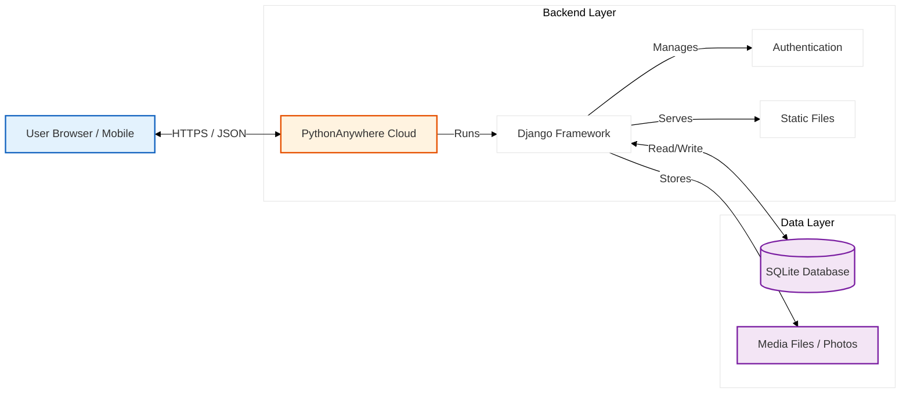
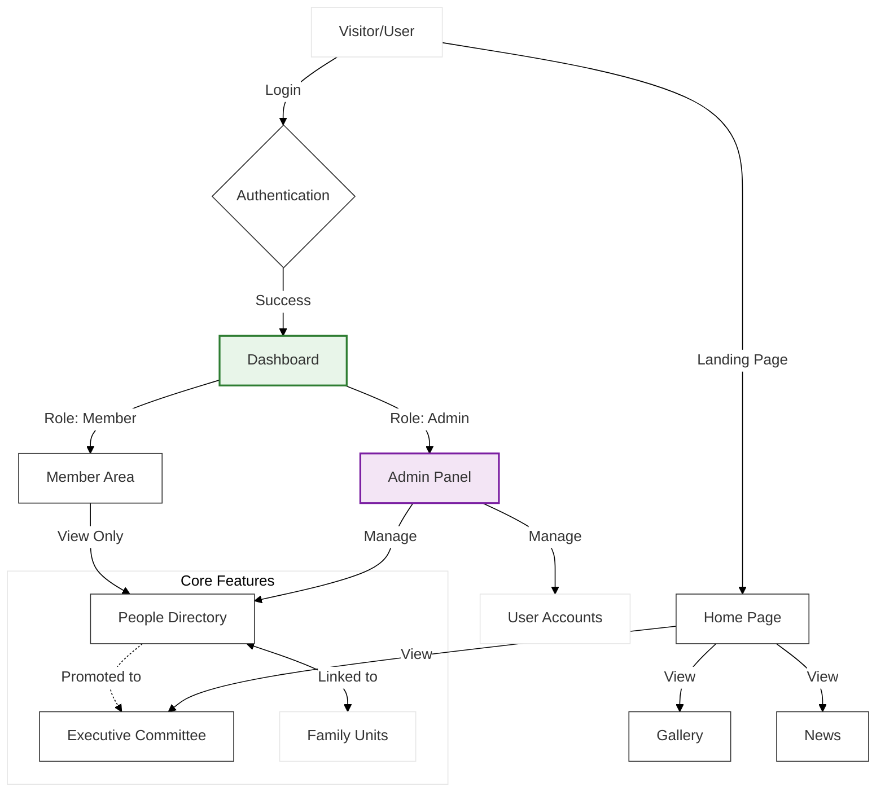
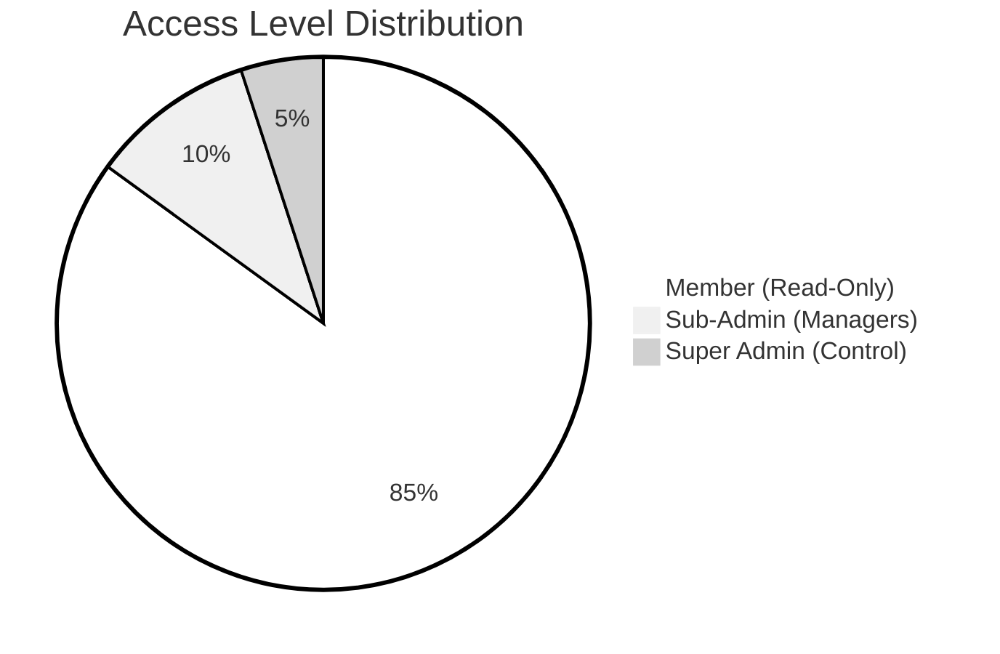
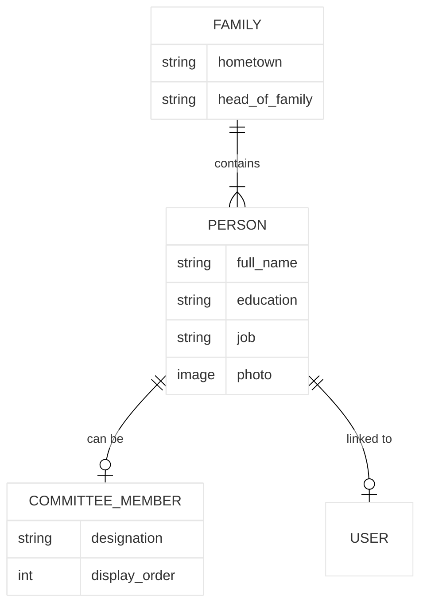

# Shree Kantha 27 Mevada Suthar Samaj - Project Documentation

## 1. Project Overview
This project is a comprehensive community management web application designed for the "Shree Kantha 27 Mevada Suthar Samaj". It serves as a digital platform to connect community members, manage family records, organize committees, and share news and events.

**Key Goals:**
- Digitize the community directory (People & Families).
- Manage the Executive Committee structure efficiently.
- Provide a platform for news, announcements, and events.
- Facilitate transparency with features like donations and gallery.

---

## 2. Technical Stack
- **Backend Framework:** Django 6.1+ (Python)
- **Database:** SQLite (Development) / MySQL or PostgreSQL (Production recommended)
- **Frontend:** HTML5, CSS3 (Custom "Orange Theme" with Glassmorphism), JavaScript (Vanilla)
- **Deployment Platform:** PythonAnywhere
- **Version Control:** Git & GitHub

---

## 3. Project Architecture & Apps
The project is modularized into several Django apps, each handling a specific domain of functionality.

### 3.1. `people` (Core Directory)
The heart of the application. It manages the community database.
- **Models:**
    - `Person`: Individual records (Name, Education, Job, Marital Status, Relations, etc.).
    - `Family`: Grouping of people by Hometown and Head of Family.
- **Key Views:** Directory List (filtering by name/city), Person Detail, Admin CRUD (Create/Read/Update/Delete) operations.
- **Features:**
    - Export Directory to Excel.
    - Automatic "Head of Family" logic management.
    - Search and Filter capabilities.

### 3.2. `management` (Committee & Governance)
Manages the governing body of the Samaj.
- **Models:**
    - `CommitteeMember`: Represents an elected member with a specific designation (e.g., Pramukh, Mantri). Enforces limits on positions (e.g., only 1 Pramukh).
    - `CommitteeSettings`: Configures the active term (Start Year - End Year).
- **Features:**
    - Visual Committee List.
    - Automatic validation of role limits (e.g., max 27 Karobari Sabhy).
    - "Add to Committee" flow directly from the People Directory.

### 3.3. `news` (Announcements)
Handles the breaking news ticker and updates.
- **Models:**
    - `NewsAnnouncement`: Stores the message, active status, and scroll speed.
- **Features:**
    - Dynamic scrolling ticker on the frontend.
    - Admin interface to adding/toggling announcements.

### 3.4. `accounts` (Authentication & Security)
Manages user access and security.
- **Models:**
    - `User`: Custom user model (extending AbstractUser) with roles (`ADMIN`, `SUB_ADMIN`, `MEMBER`).
    - `AuditLog`: Tracks critical actions (Who did what and when) for security and accountability.
- **Features:**
    - Role-Based Access Control (RBAC).
    - Custom Login/Logout views.
    - Password management.

### 3.5. `dashboard` (Admin Panel)
A custom dashboard for administrators to get a high-level view.
- **Features:**
    - Statistics widgets (Total Members, Families, Committee Status).
    - Quick links to common actions (Add Person, Add News).
    - Visual charts (Demographics).

### 3.6. `gallery` (Media)
Showcases community events and photos.
- **Models:** `MediaItem` (Titles, Images/Videos, Descriptions).

### 3.7. `locations` (Community Assets)
Lists important community locations (e.g., Samaj Wadi, Temples).
- **Models:** `Location` (Name, Address, Map Link, Contact).

### 3.8. `donations` (Transperancy)
Tracks and displays donations made to the community.
- **Models:** `Donation` (Donor Name, Amount, Date, Purpose).

---

## 4. User Roles & Permissions

| Role | Access Level | Description |
| :--- | :--- | :--- |
| **Admin** | Full Access | Can manage all data, users, and settings. Access to Audit Logs and User Management. |
| **Sub-Admin** | High Access | Can manage Directory, News, and Gallery. Restricted from changing critical system settings or deleting other Admins. |
| **Member** | Read-Only | Can view the Directory (if authorized), Gallery, News, and Committee lists. |
| **Public** | Limited | Can view "Home", "Our Team", "Gallery", "News". Cannot see sensitive Directory data (Phone numbers, etc.). |

---

## 5. Deployment Details (PythonAnywhere)
The live site is hosted on PythonAnywhere.

- **Domain:** `shreekantha27mevadasuthar.pythonanywhere.com`
- **Virtual Environment:** `/home/ShreeKantha27MevadaSuthar/.virtualenvs/myvenv`
- **Static Files:** Collected to specific static root for production serving.
- **WSGI Configuration:** Configured to serve the Django application via WSGI.

### Critical Deployment Commands
1.  **Update Code:** `git pull`
2.  **Install Req:** `pip install -r requirements.txt` (inside virtualenv)
3.  **Database:** `python manage.py migrate`
4.  **Static Files:** `python manage.py collectstatic`
5.  **Translations:** `python manage.py compilemessages`

---

## 6. Directory Structure
```
Kantha27MevadaSutha/
├── kantha_project/      # Main Project Configuration (settings.py, urls.py)
├── people/              # People & Family Directory App
├── management/          # Committee Management App
├── news/                # News Ticker App
├── accounts/            # User Auth & Audit Logs
├── dashboard/           # Admin Dashboard Logic
├── gallery/             # Photo/Video Gallery
├── locations/           # Map & Location Listings
├── templates/           # HTML Templates (organized by app)
├── static/              # CSS, JS, Images
├── locale/              # Translation Files (Gujarati/English)
├── media/               # User-uploaded content (Photos)
├── manage.py            # Django Management utility
└── requirements.txt     # Python Dependencies
```

---

## 7. Dependencies & Assets

### 7.1. Python Libraries (Backend)
These libraries are installed via `requirements.txt`:
- **`Django`**: The core web framework.
- **`pandas` & `openpyxl`**: Used for generating and exporting the "People Directory" to Excel.
- **`Pillow`**: Image processing library for handling user-uploaded photos (Member profiles).
- **`django-crispy-forms` & `crispy-bootstrap5`**: Renders Django forms utilizing Bootstrap 5 styles for a cleaner UI.
- **`sqlparse`**: Helper for SQL formating (Django dependency).

### 7.2. Frontend Libraries (CSS/JS)
- **CSS Framework**: **Custom "Orange Theme"** (`orange_theme.css`).
    - *Design Style:* **Glassmorphism** (Translucent cards, blur effects, vivid orange gradients).
    - *Features:* Responsive grid, Flexbox navigation, dark mode toggle support.
- **Fonts**: [Outfit](https://fonts.google.com/specimen/Outfit) (Google Fonts) - Modern, geometric sans-serif.
- **Icons**: [FontAwesome 6.4.0](https://fontawesome.com/) (CDN) - Used for navigation icons, action buttons, and social links.

### 7.3. Graphics & Media
Located in `static/img/`:
- **`logo.png`**: Main community logo (Header/Navbar).
- **`ticker_logo.png`**: Specialized variant for the news ticker.
- **`default_profile.png`**: Placeholder image for members who haven't uploaded a photo.

### 7.4. Other Important Components
- **News Ticker**: Custom CSS/JS implementation (no external plugin). Uses CSS `@keyframes` for smooth scrolling.
- **Language Support**: Django Internationalization (i18n) for English/Gujarati switching.

---

## 8. Visual Architecture (Presentation Charts)

### 8.1. High-Level System Overview (Whole Project)
A bird's-eye view of the entire technical ecosystem.



### 8.2. System Workflow
This flowchart demonstrates how different users interact with the system.



### 8.2. User Role Distribution (Pie Chart)
Visual representation of the user hierarchy.



### 8.3. Database Schema (Simplified)
An entity-relationship diagram showing the core data structure.



---

## 9. Future Roadmap
Strategic goals for the next phase of development.

1.  **Mobile App Integration**: Build a dedicated Flutter/React Native wrapper for push notifications.
2.  **Payment Gateway**: Automate donations and maintenance fee collection via UPI/Razorpay.
3.  **Matrimonial Section**: A discrete, secure section for finding matches within the community.

---

## 10. Mobile Responsiveness & UX
The application is fully responsive, optimized for seamless usage on smartphones and tablets.

### 10.1. Breakpoint Implementation
The primary breakpoint is set at **`max-width: 768px`** (Tablet/Mobile Portait).
- **CSS Logic**: `@media (max-width: 768px)` in `orange_theme.css`.

### 10.2. Key Mobile Features
1.  **Adaptive Navigation**:
    - **Desktop**: Horizontal Navbar with dropdowns.
    - **Mobile**: The top navbar simplifies, and the **Sidebar** becomes a **Slide-out Drawer**.
        - *Mechanism*: A "Hamburger Menu" (`.hamburger`) appears. clicking it toggles the `.active` class on the `.app-sidebar`, sliding it in from the left (`transform: translateX(0)`).

2.  **Optimized Layouts**:
    - **Grids**: The `auto-fit` CSS Grid logic (used in Management and Dashboard modules) automatically stacks cards vertically (1 column) on small screens instead of squeezing them horizontally.
    - **Touch Targets**: Buttons and links have increased padding (`1.5rem`) to ensure they are easily tap-able.

3.  **Typography**: Base font size adjusts to **15px** for better readability on small screens.

4.  **Performance**:
    - The **News Ticker** is sticky at the bottom (`position: fixed; bottom: 0;`) on mobile for easy visibility without obstructing content.
    - **Sidebar Scrollbar**: The visual scrollbar is hidden (`scrollbar-width: none`) to maximize screen real estate while retaining scrolling functionality.
